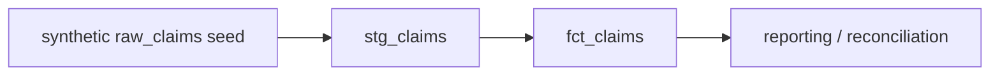

# Healthcare Data Quality & Lineage Control Framework

A synthetic healthcare analytics-engineering project focused on **data validation, source-to-target reconciliation, dbt tests, lineage, and release controls**. It is designed as a public portfolio implementation rather than employer production code.

## Verified portable path

```bash
python src/reconcile.py --source data/source_claims.csv --target data/curated_claims.csv
python -m unittest discover -s tests -v
```

The reconciliation checks:
- row count;
- claim-ID set equality;
- duplicate IDs;
- monetary control totals;
- required columns;
- numeric amount validity.

## dbt / DuckDB local project

The repository also contains a locally runnable dbt project using synthetic seed data and DuckDB.

```bash
pip install -r requirements-dbt.txt
dbt seed --profiles-dir .
dbt run --profiles-dir .
dbt test --profiles-dir .
```

## Lineage



See [`docs/LINEAGE.md`](docs/LINEAGE.md).

## Controls represented

- `not_null` and `unique` dbt tests on claim IDs;
- accepted-value test on claim status;
- positive-amount test using a singular dbt test;
- source/target reconciliation utility;
- CI running Python checks plus dbt seed/run/test;
- synthetic-only public data policy.

## Technologies

Python · SQL · dbt · DuckDB local validation · Snowflake-compatible modeling concepts · Data Quality · Reconciliation · Data Lineage · GitHub Actions

## Author

**Nithin Konjeti** — Data Engineer  
[Portfolio](https://applywizz-nithinkonjeti-36111.vercel.app/) · [LinkedIn](https://www.linkedin.com/in/nithin-konjeti/)
