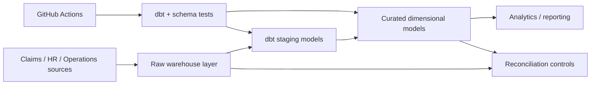

# Healthcare Data Quality & Lineage Control Framework

A synthetic analytics-engineering project focused on the controls that make warehouse data trustworthy: **schema validation, dbt tests, reconciliation, source-to-target lineage, and CI release checks**.

> This is an independent portfolio implementation using synthetic data. It contains no employer code, PHI, PII, proprietary schemas, or internal configuration.

## Architecture



## Controls demonstrated

- required-field and uniqueness testing
- source-to-target record-count reconciliation
- monetary control-total reconciliation
- duplicate detection
- reusable staging/curated SQL models
- documented lineage between raw, staging, and curated layers
- CI checks before a change is considered release-ready

## Repository layout

```text
models/                dbt-style staging and mart models
src/reconcile.py       source-vs-target reconciliation utility
data/                  synthetic sample inputs/outputs
tests/                 automated tests
docs/LINEAGE.md        lineage documentation
.github/workflows/     CI validation
```

## Run locally

```bash
python -m venv .venv
# activate the environment
pip install -r requirements.txt
pytest -q
python src/reconcile.py --source data/source_claims.csv --target data/curated_claims.csv
```

## Why this matters

Successful data platforms do more than move records. Downstream users need to know that datasets are complete, structurally valid, traceable to sources, and reconciled before they reach analytics. This project isolates those controls so they are visible and testable.

## Technologies represented

Python · SQL · dbt-style modeling · Snowflake-compatible warehouse patterns · GitHub Actions · Data Quality · Reconciliation · Lineage · Metadata

## Author

**Nithin Konjeti** — Data Engineer  
[Portfolio](https://applywizz-nithinkonjeti-36111.vercel.app/) · [LinkedIn](https://www.linkedin.com/in/nithin-konjeti/)
