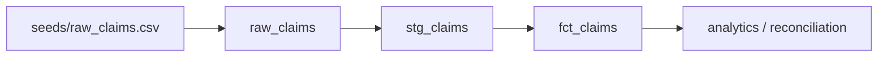

# Source-to-target lineage

The public implementation contains a synthetic claims slice. The same control pattern can be extended to other healthcare domains without publishing employer schemas or records.
