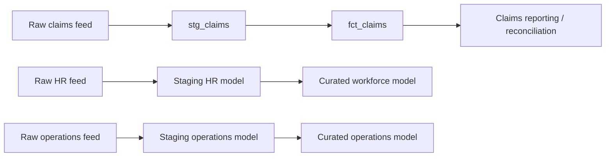

# Source-to-target lineage

The public repository implements the claims slice with synthetic data and documents the same control pattern for additional domains. No employer schemas or healthcare records are included.
